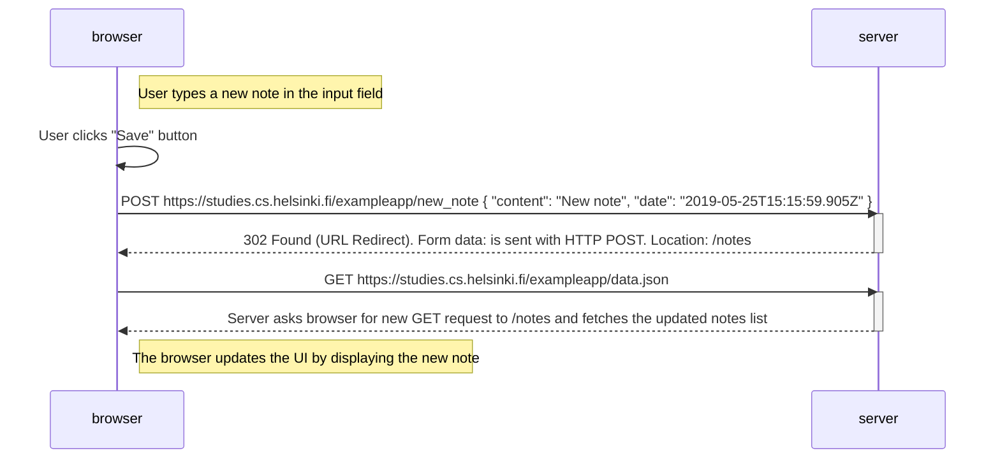

```mermaid
sequenceDiagram
    participant browser
    participant server

    Note right of browser: User types a new note in the input field

    browser->>browser: User clicks "Save" button

    browser->>server: POST https://studies.cs.helsinki.fi/exampleapp/new_note { "content": "New note", "date": "2019-05-25T15:15:59.905Z" }
    activate server
    server-->>browser: 302 Found (URL Redirect). Form data: is sent with HTTP POST. Location: /notes
    deactivate server

    browser->>server: GET https://studies.cs.helsinki.fi/exampleapp/data.json
    activate server
    server-->>browser: Server asks browser for new GET request to /notes and fetches the updated notes list
    deactivate server

    Note right of browser: The browser updates the UI by displaying the new note
```
