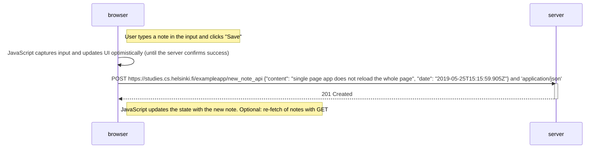

```mermaid
sequenceDiagram
    participant browser
    participant server

    Note right of browser: User types a note in the input and clicks "Save"

    browser->>browser: JavaScript captures input and updates UI optimistically (until the server confirms success)

    browser->>server: POST https://studies.cs.helsinki.fi/exampleapp/new_note_api {"content": "single page app does not reload the whole page", "date": "2019-05-25T15:15:59.905Z"} and 'application/json'
    activate server
    server-->>browser: 201 Created
    deactivate server

    Note right of browser: JavaScript updates the state with the new note. Optional: re-fetch of notes with GET
```
